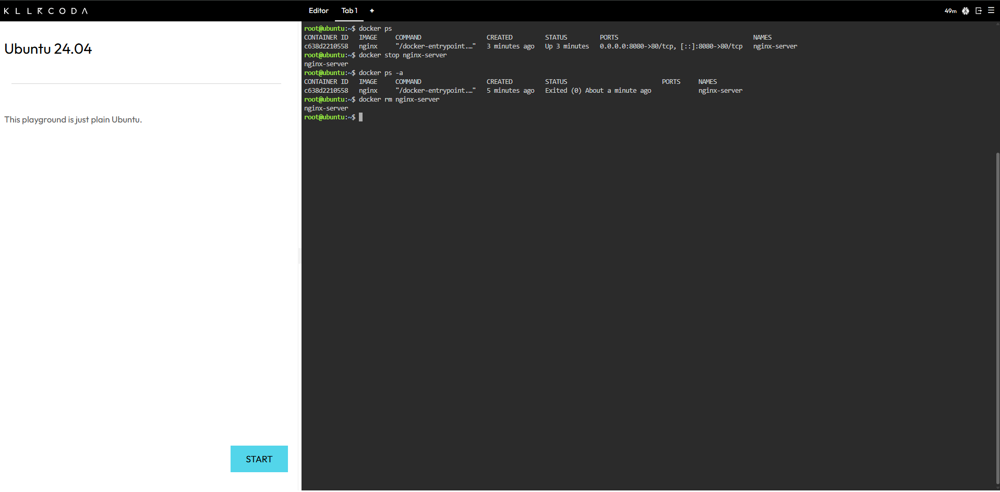
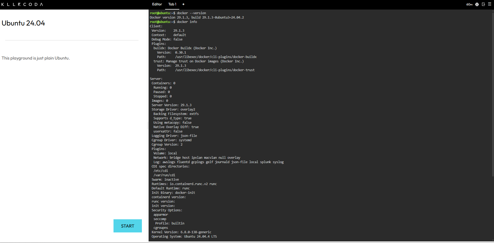
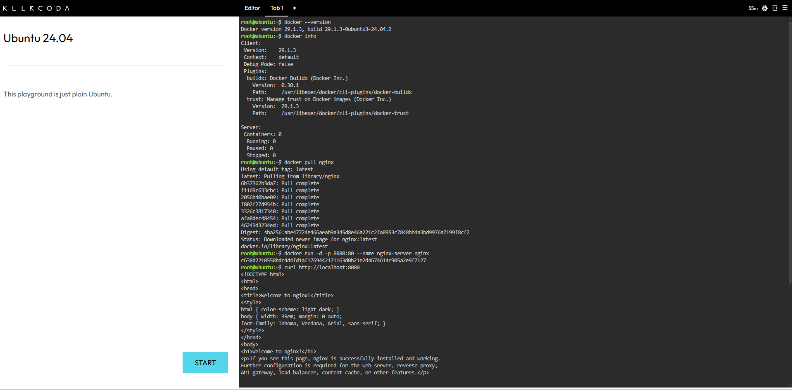

# Mission 4: The Cloud-Native Engineer

## Mission Overview

Modern cloud computing is no longer just about renting Virtual Machines (VMs) from
providers like AWS or Azure. Increasingly, applications are built using containers —
lightweight, portable units that start in seconds and run consistently across
environments.

This lab covers that shift from traditional virtualization to containerization.
Using the KillerCoda Playground, I worked through the differences between VMs and
containers, ran through the core Docker CLI commands, and deployed a live,
containerized Nginx web server.

A traditional system administrator manages servers. A cloud-native engineer manages
the services running on them.

## Objectives

By the end of this activity, I should be able to:

* Differentiate between traditional Virtual Machines and Containers.
* Access a Docker-enabled cloud environment using KillerCoda.
* Execute fundamental Docker CLI commands.
* Pull, run, manage, and terminate a containerized application (Nginx).
* Document container operations clearly using Markdown.
* Continue building out a structured GitHub Cloud Computing Portfolio.

## Docker Commands Executed

The table below covers the commands run during the activity, grouped roughly by
stage: verifying the Docker environment, deploying Nginx, testing the web server,
and managing the container's lifecycle.

| Command | What it does |
|---|---|
| `docker version` | Shows the installed Docker client and server versions. |
| `docker info` | Shows the state of the Docker environment — containers, images, storage driver, and general configuration. |
| `docker pull nginx` | Downloads the official Nginx image from Docker Hub. |
| `docker run -d -p 8080:80 nginx` | Starts an Nginx container in detached mode and maps host port `8080` to container port `80`. |
| `curl http://localhost:8080` | Sends a request to the mapped port to confirm Nginx is serving traffic. |
| `docker ps` | Lists running containers — ID, image, status, ports, and name. |
| `docker stop competent_panini` | Stops the running Nginx container (auto-named `competent_panini`). |
| `docker ps` | Re-checked to confirm `competent_panini` was no longer running. |
| `docker ps -a` | Lists all containers, including stopped ones — confirmed `competent_panini` with an `Exited (0)` status. |
| `docker rm competent_panini` | Removes the stopped container from the environment. |
| `docker ps -a` | Final check confirming the container no longer appears in the list. |

## Container Lifecycle

```text
Running
   |
docker stop competent_panini
   |
Stopped
   |
docker rm competent_panini
   |
Removed
```

The container was identified with `docker ps`, stopped with `docker stop`, its
stopped state confirmed with `docker ps -a`, then removed with `docker rm` and
verified a final time.

### Evidence



## Skills Learned

* The architectural differences between Virtual Machines and Containers.
* Working in a Docker-enabled cloud environment (KillerCoda).
* Core Docker CLI commands and what each one does.
* Verifying a Docker installation and checking environment status.
* Pulling and running a containerized Nginx web server.
* Mapping a host port to a container port.
* Testing a containerized service with `curl`.
* Listing and inspecting containers in different states.
* Stopping and removing containers.
* The basic Docker container lifecycle, start to finish.
* Writing clear technical documentation in Markdown.
* Maintaining a structured GitHub portfolio.

## Challenges Encountered

The main challenge was getting familiar with the Docker CLI — specifically,
understanding what each command actually does rather than just running it. It also
mattered to use the container's real name in later commands, since Docker assigns a
random name (`competent_panini`, in this case) if one isn't set explicitly:

```bash
docker stop competent_panini
docker rm competent_panini
```

The other adjustment was getting clear on the distinction between a running,
stopped, and removed container. `docker ps` only shows what's active; `docker ps -a`
shows the full history, including anything stopped but not yet removed. Working
through the lifecycle step by step — identify, stop, verify, remove, verify again —
made this much clearer than reading about it would have.

## Laboratory Evidence

### Docker Version



### Nginx Container Running



### Container Lifecycle


